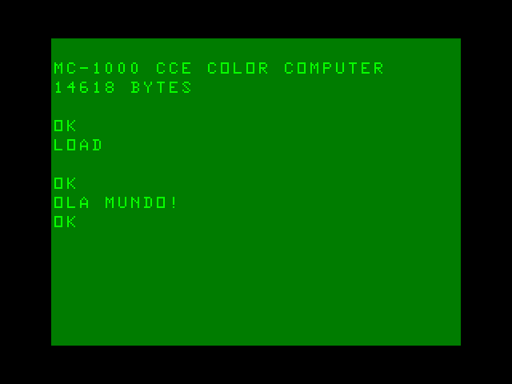

# Còdigo para MC-1000

Este repositório contém alguns programas criados para o computador
[MC-1000 Color Computer](https://sites.google.com/site/ccemc1000/) fabricado
pela CCE e comercializado entre os anos de 1985 e 1986.

## helloWorld.asm



Um exemplo simples de programa escrito em _assembly_ para ser montado com
o **Pasmo**, convertido para um arquivo de áudio e transferido para o
computador através da porta do gravador cassete.

## almostDemo512.asm


Uma animação simples utilizando o modo de vídeo 0x98 -- 128×192 e 4 cores -- e ocupando apenas 512 bytes da memória RAM.

# Montagem e execução

Utilize o **pasmo** para montar o programa:

``` shell
$ pasmo -d «programa.asm» «programa.bin»
```

Converta para áudio com:

``` shell
$ java Bin2Wav «programa.bin»
```

Digite ```LOAD``` no MC-1000 e toque o arquivo de áudio.
